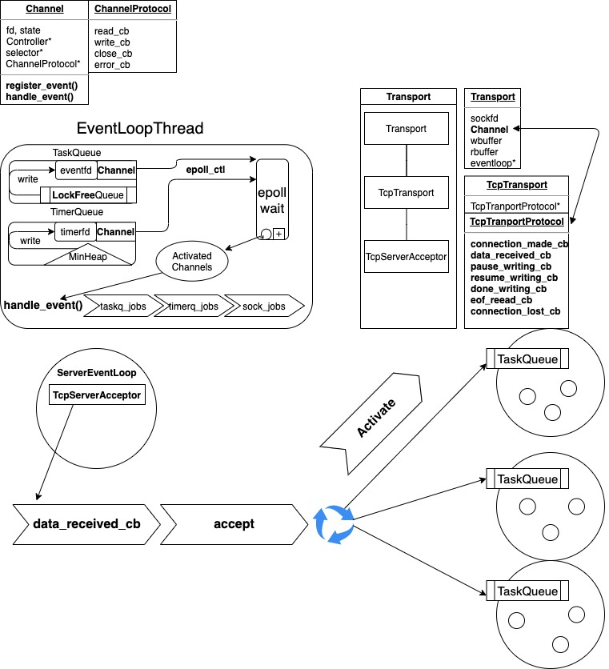

### A performant reactor based tcp server

- [x] timeout handling
- [ ] client
- [ ] udp connection
- [ ] http parser and http connection


#### Test

- os: linux
- compiler: c++17 support

```bash
cmake ./ && make
./netyo
```

#### schema



#### reference:
- https://github.com/an-tao/trantor
